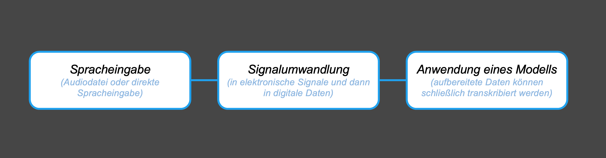

## Ausgerechnet Algorithmen

[Dan Verständig](https://www.uni-bielefeld.de/ew/verstaendig), [Janne Stricker](https://www.uni-bielefeld.de/ew/stricker)

## Allgemeine Informationen

Gesprochene Sprache ist für Menschen ein besonders wichtiges Kommunikationsmittel, und die Mehrheit der Weltbevölkerung verlässt sich auf Sprache, um miteinander zu kommunizieren. [Automatische Systeme der Spracherkennung](https://de.wikipedia.org/wiki/Spracherkennung) (ASR) übersetzen gesprochene Sprachen in Text. Es gibt verschiedene Beispiele für ASR. Zum Beispiel erkennt [Siri](https://de.wikipedia.org/wiki/Siri_(Software)) von Apple die Sprache und wandelt diese in Text um. Auch [Alexa](https://de.wikipedia.org/wiki/Amazon_Alexa) von Amazon erkennt automatisch Sprache und verarbeitet Befehle, die an die Geräte gehen. Die automatische Erkennung von Sprache ist ein komplexer Prozess. Ganz einfach erklärt kann er wie folgt dargestellt werden.

Zunächst wird die Spracheingabe in elektronische bzw. digitale Daten umgewandelt. Mit einem stochastischen Modell werden die strukturierten Spracheingabedaten in Text umgewandelt. Hier könnte ein [Hidden Markov Model (HMM)](https://de.wikipedia.org/wiki/Hidden_Markov_Model) die Grundlage bilden.

Auch Soziale Medien bieten inzwischen auch verschiedene Möglichkeiten der Verarbeitung von Spracheingabe an. Gerade für Menschen mit Behinderungen könnten Anwendungen zur Spracherkennung hilfreich bei der Artikulation oder Teilhabe sein. Dennoch gibt es sowohl technische als auch menschliche Faktoren, die Entwicklungen in diesem Bereich ausbremst.

Der hier abgelegte Code dient zur Exploration von Spracherkennung und steht im Zusammenhang zur Publikation Ausgerechnet Algorithmen (2023). Die Publikation geht auf die Präsentation der Forschung zu Teilhabefragen und ASR am Beispiel von TikTok  auf der Herbsttagung der Sektion Medienpädagogik an der Universität Bielefeld im Jahr 2022 zurück. Der Code setzt sich aus einem einfachen Skript zur Spracherkennung allgemein und einem Live System, welches mit [Google Speech Recognition](https://cloud.google.com/speech-to-texthttps:/) arbeitet.

## Wie man den Code benutzen kann

Die Skripte sind kommentiert. Anhand der Kommentierungen sollte man grundlegend die funktionsweise der Skripte nachvollziehen und unterschiedlichen Zielgruppen erklären können. Der Code kann ausgeführt und erprobt werden. Es sind sehr einfache und grundlegende Beispiele, die erweitert werden können.

Der Code dient zur Grundlage, um über die Systeme und Wirkweisen in medienpädagogischen Settings ins Gespräch zu kommen.

### Installation

1. Die Skripte erfordern [Python 3](https://www.python.org/downloads/) und eine Entwicklungsumgebung. Python kann mit [diesem Codeschnipsel von Michael Currin](https://gist.github.com/MichaelCurrin/57caae30bd7b0991098e9804a9494c23) installiert werden.
2. Wir empfehlen [Microsoft Visual Code](https://code.visualstudio.comhttps:/) als Entwicklungsumgebung.
3. Für die Skripte sind jeweils unterschiedliche Python Bibliotheken notwendig. Diese können über die Paketverwaltung installiert werden.

### Einfache Spracherkennung: simple_sr.py

Das Skript nutzt die Bibliothek [SpeechRecognition](https://pypi.org/project/SpeechRecognition/). Es handelt sich um eine Umgebung mit Unterstützung für verschiedene Engines und Schnittstellen, die Spracherkennung sowohl online als auch offline ermöglichen.

### Spracherkennung mit User Interface: simple_sr_ui.py

Das Skript startet die Anwendung mit einer deutschsprachigen Benutzeroberfläche. Man kann entweder eine Audiodatei auswählen oder das Mikrofon für die Spracherkennung verwenden. Der erkannte Text wird auf der Benutzeroberfläche angezeigt. 

Tipp: man kann am MacOs auch eigene Sprachdateien über den say-Befehl im Terminal generieren. Ein einfaches Beispiel wäre wie folgt:

`say "Hallo, das ist eine Testaufnahme." -o "biespielaufnahme.wav" --data-format=LEI16@32000`

### ASR mit Google Cloud: my_live_transcription.py

Dieses Skript verwendet die Google Cloud Speech Recognition API, um Sprache in Text umzuwandeln. Es erlaubt die Eingabe von Sprache über ein Mikrofon und die Echtzeittranskription im Terminal.

Die Nutzung des Skripts erfordert eine Internetverbindung sowie einen Google Account. Die Authentifizierung erfolgt über [`gcloud auth`](https://cloud.google.com/sdk/gcloud/reference/auth).

**Die Google-Spracherkennungs-API ist eine vergleichsweise niederschwellige Methode, um Sprache in Text umzuwandeln, aber sie erfordert eine Internetverbindung. Zudem werden die Daten mit Google verarbeitet. Da Google als Dienstanbieter agiert, können auch Kosten bei der Nutzung von Cloud-Diensten entstehen.**

Das Skript ist kommentiert und sollte auch Zeile für Zeile erklärbar sein. Hier ist eine Erläuterung des Skripts:

1. Es werden die benötigten Module und Klassen importiert: `division` aus `__future__` für die Division, `speech` aus `google.cloud` für die Google Cloud Speech Recognition API, `re` für reguläre Ausdrücke, `sys` für den Zugriff auf das System und `pyaudio` für die Audioaufnahme und -wiedergabe. Die `queue`-Klasse wird für das Puffern von Audiodaten verwendet.
2. Es werden einige Aufzeichnungsparameter festgelegt, wie die Abtastrate (`RATE`), die Größe des Audioblocks (`CHUNK`) und der Sprachcode (`language_code`) für die Spracherkennung. Diese Parameter können je nach Anforderungen und Geräteeinstellungen angepasst werden.
3. Die Klasse `MicrophoneStream` wird definiert. Diese Klasse öffnet einen Aufnahmestream und dient als Generator, um Audioblöcke zu erzeugen. Der Generator sammelt kontinuierlich Daten aus dem Audio-Stream in einem Puffer (`_buff`).
4. Die Methode `listen_print_loop` wird definiert. Sie iteriert durch die Serverantworten der Spracherkennung und gibt sie aus. Es wird nur die Transkription der obersten Alternative des obersten Ergebnisses zurückgegeben. Zwischenergebnisse werden während der Spracherkennung angezeigt, und für endgültige Ergebnisse wird ein Zeilenumbruch ausgegeben. Das Skript wird beendet, wenn das erkannte Wort "quit" oder "tschüss" ist.
5. Die Methode `main` wird definiert. Sie ist der Haupt-Loop des Skripts. In diesem Loop wird die Verbindung zur Google Cloud Speech Recognition API hergestellt und die Spracherkennung gestartet. Dabei werden die Konfigurationen und Audioinhalte übertragen.
6. Schließlich wird der Haupt-Loop `main` aufgerufen, um das Skript zu starten.
